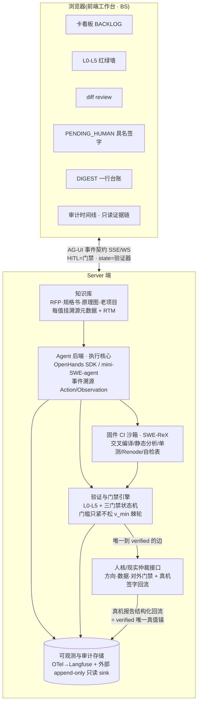

# 架构 · swe-agent

> 合成自 5 个互盲视角的带证据盲点扫描(嵌入式固件领域 / SWE-agent 开源生态 / Agent 前端 / 产品硬件认证 / 方法论映射与对抗红队)。
> 设计原则:**最大化复用开源(要求#7),只自建现成框架不具备的 YCFS 治理不变量。**

## 一、总览

swe-agent 是一个 BS 架构的嵌入式固件编码助手:复用成熟开源编码 agent 作**执行核心**、SWE-ReX 抽象**沙箱**、OTel+Langfuse 作**观测底座**,在其之上自建一层薄 **YCFS 治理层**(验证器 L0–L5 裁决 + 三门禁状态机 + 真值出生证 + 裁判与被测物理分离)。

它把 RFP / 规格书 / 原理图 / 器件·MCU 规格书 / 老项目资料结构化消化为**知识库**,产出两类性质根本不同的交付物:
- **系统方案**(工程判断密集)—— 人门禁 + 逐值溯源结案;
- **可编译固件 + 表格自测**(机器可验证)—— 确定性检查器结案。

**核心承重设计**:编译绿 ≠ 功能对,所有安全裁决结构上止于「待真机」;最高现实仲裁是人的真机测试与 VDE/UL 认证签字。现成框架只提供打分/记轨迹的能力,不提供 YCFS 的治理不变量,后者是必须自建的核心 IP,而非重造整个 agent。

## 二、BS 架构与数据流

**主数据流**:RFP/规格书/原理图/器件·MCU 规格书/老项目资料 → 知识库结构化摄取(每值挂溯源元数据 + 需求↔实现↔验证 RTM)→ agent 消化产出两条支线:(A)系统方案(选型/BOM/框图,逐值溯源,人门禁结案);(B)固件代码(CubeMX/应用层)→ 固件 CI 沙箱跑 L-static(交叉编译/MISRA/单测/自检表)+ L-sim(Renode)→ 验证引擎裁决(N 腿全绿=CI 绿,**但不等于 verified**)→ 待真机 → 人上真机测试 + 签字 → 证据结构化回流 → 唯一真值锚 → `verified`。全过程事件溯源落 append-only 审计 sink。

## 三、七大组件与开源底座

| # | 组件 | 责任 | 开源底座 / 自建理由 |
|---|---|---|---|
| 1 | **前端工作台(BS)** | 卡看板 · L0–L5 红绿墙 · diff review · PENDING_HUMAN 具名签字 · DIGEST 台账;方案评审视图与固件 CI/表格视图分区;workbench-first,chat 退居侧栏 | `assistant-ui`(MIT)或 `Vercel AI SDK + AI Elements`(Apache-2.0)作可组合原语;`shadcn/ui`+`Tremor`+`Monaco/react-diff-view` 搭专属视图;`AG-UI`(MIT)作前后端事件契约(门禁=HITL 事件,验证器状态=state 事件)。**没有任何现成聊天 UI 建模 YCFS 核心对象(红绿墙/具名签字/证伪条件),专属视图必须自建。** |
| 2 | **Agent 后端(执行核心)** | 读需求→写码/出方案→跑门禁→改;事件溯源轨迹确定性回放;每步 diff 一次带**署名**提交 | `OpenHands Software Agent SDK`(MIT,事件溯源 + REST/WebSocket)作脊柱;`mini-SWE-agent`(MIT,~100 行,线性轨迹极易审计)作轻量备选;Aider 的「(aider)署名」作模型署名范式。事件溯源天然是「可追索/可审计」的原生实现。 |
| 3 | **验证与门禁引擎** | 一条命令 N 腿全绿;L0 真值锚(规格书+60730 表+认证 STL,带出生证)、L1 引用解析核验、L2 并列独立腿、L3 夜检、L4 被测不能自证、L5 异模语义裁判;门槛只紧不松;状态机结构性删除「gate 全绿→verified」直达边 | **自建薄治理层(核心 IP)** + gate 运行器。裁决逻辑/棘轮/provenance/自证封锁无现成框架——Langfuse 的 LLM-judge 甚至默认允许裁判=被测同模。 |
| 4 | **知识库** | 规格书/寄存器表/引脚表结构化摄取;每值挂溯源元数据 `{文档,版本,页,表/条,errata}`;需求↔实现↔验证 RTM;区分「规范性引用」与「仅供参考(老项目带勘误标签)」 | `pdfplumber`/`Camelot`(MIT)**确定性 PDF 解析(反伪造引用)**;`Doorstop`/`StrictDoc`/`OpenFastTrace` 作 RTM 骨架;`in-toto`/`SLSA` 作出生证。NDA 受限时用本地 `PyMuPDF` 而非云端 LlamaParse。 |
| 5 | **固件 CI 沙箱** | 交叉编译(arm-none-eabi-gcc+CMake headless,产 .elf/.map/size)、静态分析(cppcheck+clang-tidy-misra)、host 单测(Ceedling+Unity+CMock)、Renode+Robot Framework 仿真、60730 自检覆盖表核对;镜像矩阵按产品线/MCU 分叉 | `SWE-ReX`(MIT)抽象沙箱(Docker/云/本地可切换);`Docker gcc-arm-none-eabi`;`Renode`(MIT);`Ceedling`(MIT);`cppcheck`+`clang-tidy-misra`;`Robot Framework`。**Renode 无电机/逆变器物理模型,FOC 闭环/热/声/EMC 结构上不可仿真——界定 L-sim 天花板。** |
| 6 | **可观测与审计存储** | trajectory 回放 · 审计时间线 · 每步 diff+决策+模型署名留痕;L0 真值集/L4 覆盖增长承载于 datasets/scores;落**外部 append-only 只读**审计 sink | 仪表化走 `OTel GenAI semconv`+`OpenLLMetry`(Apache-2.0,厂商中立可迁移);存储用 `Langfuse`(核心 MIT 自托管);`Phoenix`(ELv2,仅内部)作备选。埋点绑 OTel 而非专有 SDK,规避后端锁定。 |
| 7 | **人核 / 现实仲裁接口** | 承接方向门禁提案审批、数据门禁具名确认、对外门禁 pending_review、**真机测试签字回流**;真机报告(示波器/量测/签字表)结构化进审计链作 `verified` 真值锚 | `assistant-ui` inline approval / `LangGraph` interrupt 作审批 UI 参考;签字产物 schema 自建,一次 approve 只绑一个具名产物(概括授权无效)。**真机在平台外发生,证据不回流则审计链在最高仲裁处断裂。** |

## 四、L0–L5 与三门禁在固件域的映射

见 [verifier-firmware.md](verifier-firmware.md) 的完整展开。一句话概括:

- **L0 真值**:锚=人已接受的规格书条款 + IEC 60730 Annex H 表 H.11.12.7 + 厂商认证 STL,带出生证(标准编号·版本·条款·页);**老项目仅条件性参考,绝不作真值锚**(否则复刻历史 bug = 与过去的自等式)。
- **L1 出口零编造**:每个对外数字用 pdfplumber/Camelot **确定性解析回规格书某页某表(引用解析而非引用存在)**;中英规格书护栏等强。
- **L2 门禁腿**:交叉编译 / 静态分析-MISRA / host 单测 / Renode 仿真 / 60730 自检覆盖表——并列独立,任一绿不代言其他;门槛只紧不松。
- **L3 夜检**:定时重跑全 gate + 溯源链重解析(防 errata/规格 revision 悬空)+ 自检项数防静默变少 + 缺勤告警。
- **L4 被测不能自证**:自检表真值列由独立来源重新推导,与被测生成物物理隔离。
- **L5 语义裁判**:异模、与设计 agent 物理分离、不共享 RAG 上下文、保守偏置(只能绿改红)。
- **三门禁**:方向门禁=MCU/RTOS/电机拓扑/60730 安全等级选型(AI 带理由提案,不单方提交);数据门禁=NDA 规格书/原理图 denylist 命中硬停,逐一具名确认;对外门禁=方案交付 + 真机签字,状态机上不存在绕过人审的边。

## 五、为什么不直接用某个现成 agent 框架就好

现成编码 agent(OpenHands / SWE-agent / Aider / Cline)解决的是「**AI 怎么写码**」;现成 eval 平台(Langfuse / Phoenix)解决的是「**怎么给一次运行打分/记轨迹**」。它们都**不解决** YCFS 的核心问题——「**工作是否成立由谁、按什么不可绕过的规则裁决**」:

- 被测不能自证:没有框架禁止「裁判=被测同一模型」「真值锚=被测自己的输出」。
- 门槛只紧不松:没有框架把验收阈值做成单调棘轮(只能变严)。
- 门禁是结构缺失边:没有框架在状态机上**删除**「跑绿了就算通过」这条边、强制它穿过人审。
- 真值有出生证:没有框架要求真值锚记录「谁编的/何时/被谁接受/错误率」。

所以架构=**复用它们的执行/观测/前端能力 + 自建一层薄治理层承载上述不变量**。这层薄治理层,就是 swe-agent 相对通用工具的护城河。
